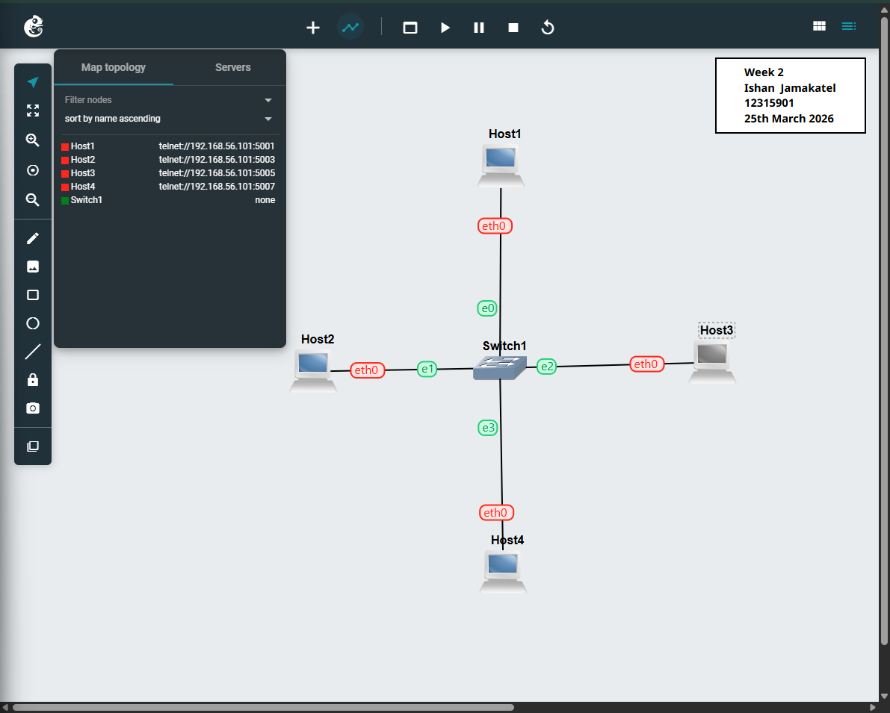
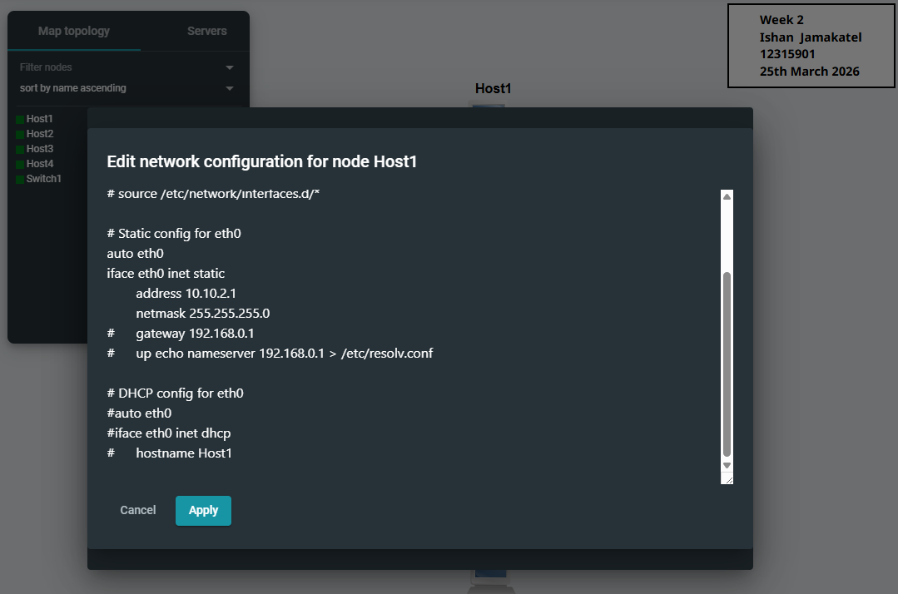
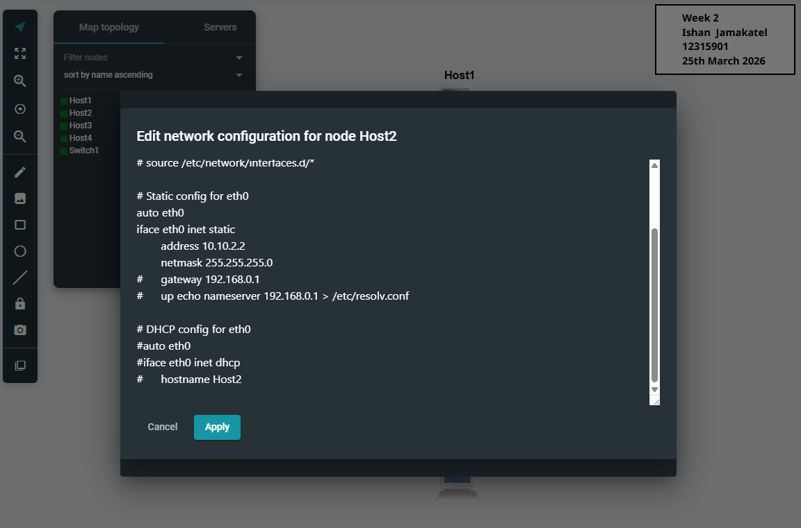
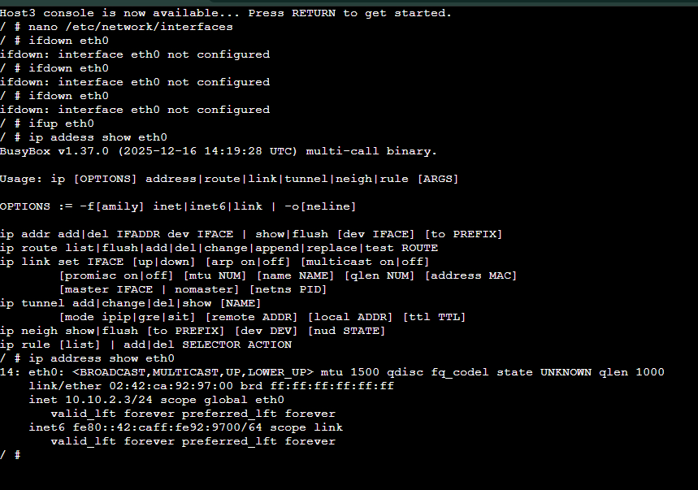
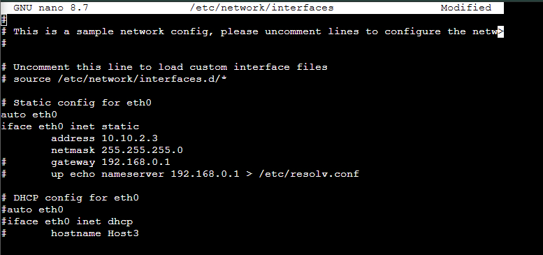
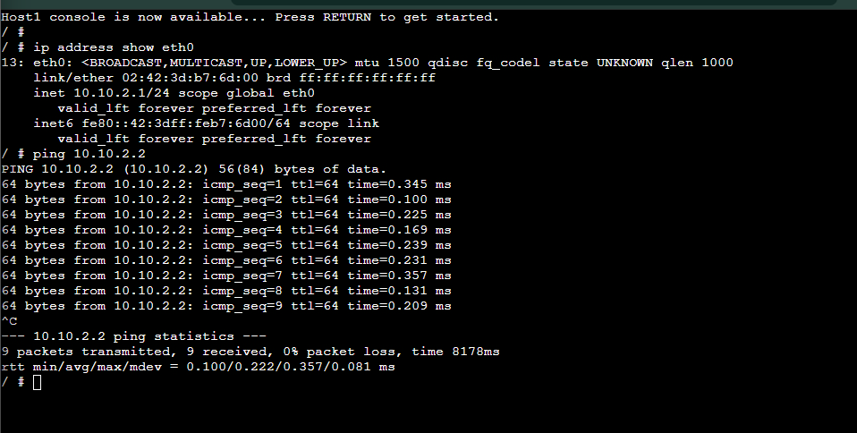
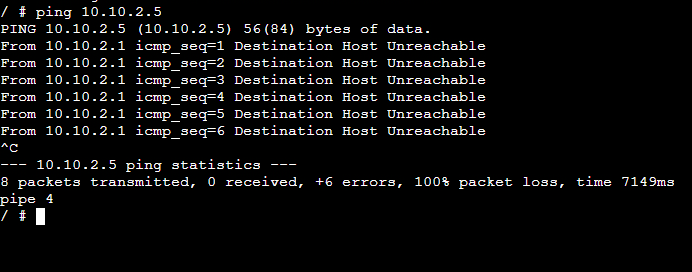

# Week 2 – Static IP Configuration and Connectivity

## Overview
This week involved creating a star topology in GNS3 and configuring multiple hosts with static IP addresses using different methods. Network connectivity was then tested using ping.

## Screenshots

### Topology Setup

### Host 1 Configuration

### Host 2 Configuration

### Host 3 Nano Configuration

### Host 3 Verification

### Host 4 Configuration

### Successful Ping

### Failed Ping

### Advanced Ping

## Configuration
Four hosts were configured with static IP addresses using different methods:

- Host1: 10.10.2.1  
- Host2: 10.10.2.2  
- Host3: 10.10.2.3  
- Host4: 10.10.2.4  

The following methods were used:
- Pre-boot configuration (Host1 & Host2)  
- Editing configuration using nano (Host3)  
- Direct IP assignment using terminal commands (Host4)  

## Testing Results
Network connectivity was tested using the ping command.

Successful ping between Host1 and Host2:
- 0% packet loss  
- Low latency  

Failed ping to a non-existent IP address (10.10.2.5):
- 100% packet loss  

Advanced ping options were used:
- `-c` to limit number of packets  
- `-i` to set interval  
- `-s` to define packet size  

## Key Concepts
- Star topology  
- Static IP configuration methods  
- Network connectivity testing  
- Packet loss and latency  

## Reflection
This task helped me understand different ways to configure IP addresses in Linux. Using multiple methods showed how flexible network configuration can be. Testing with ping also helped confirm whether devices were communicating correctly.
