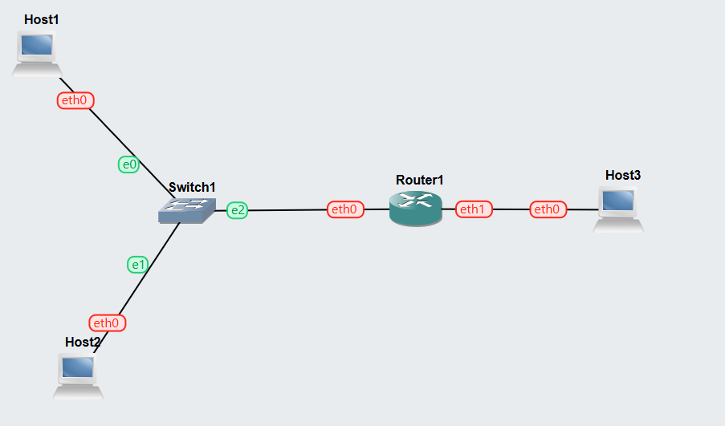
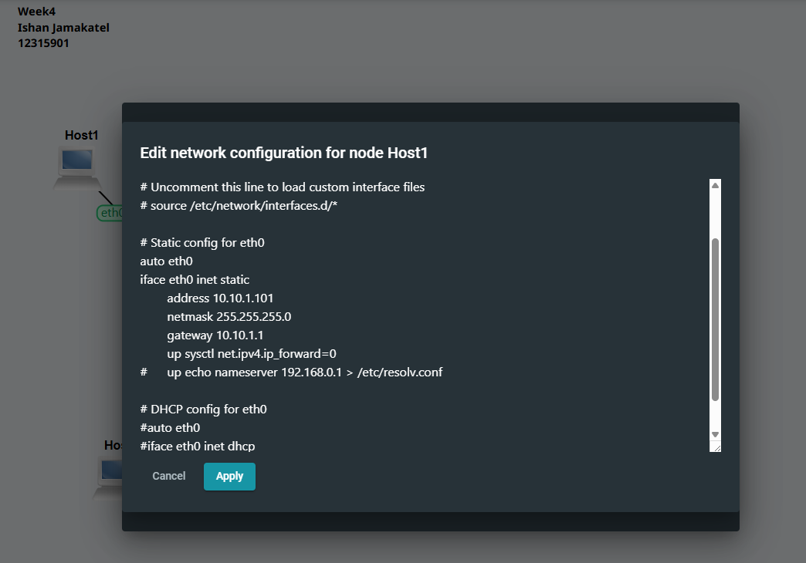
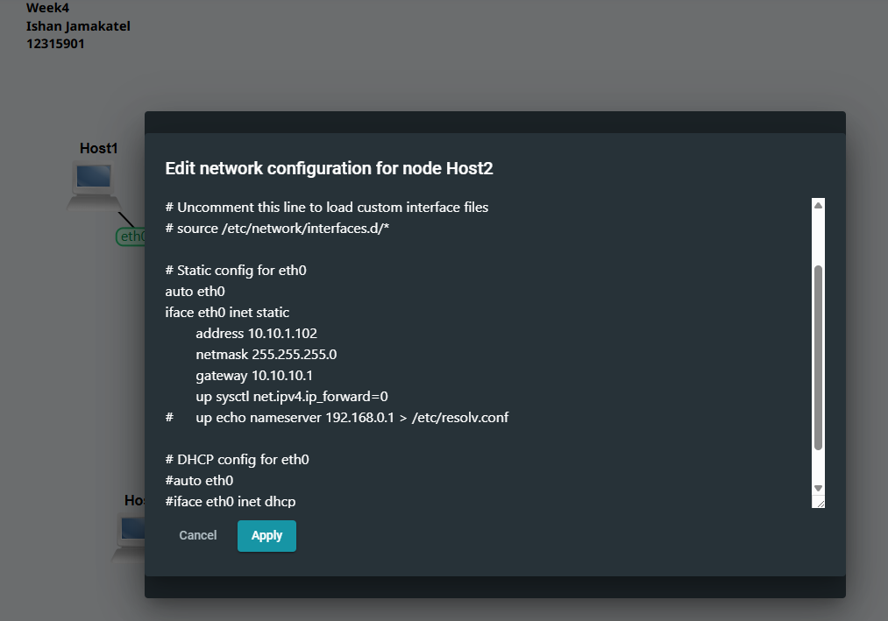
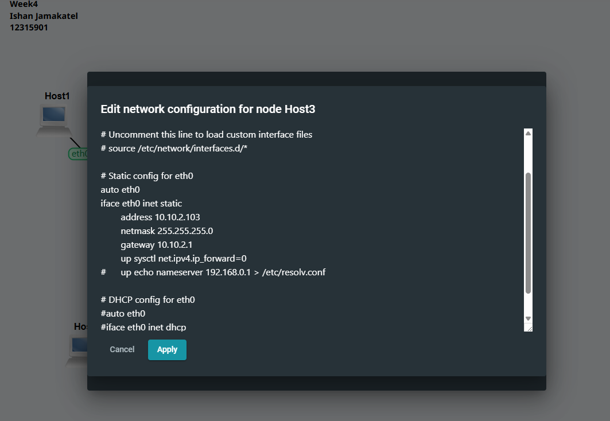
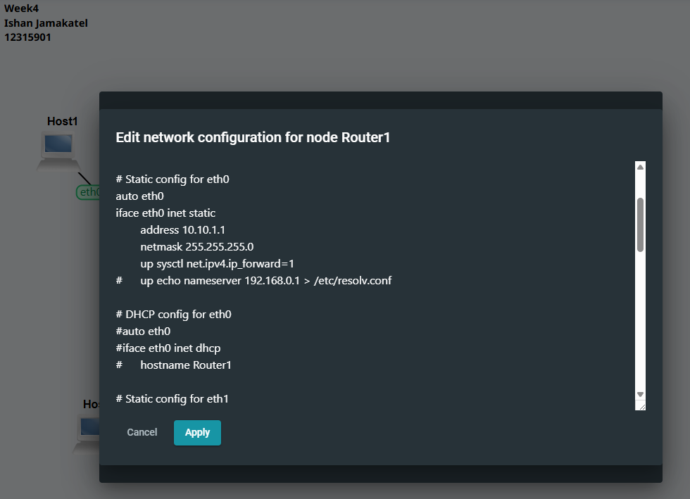
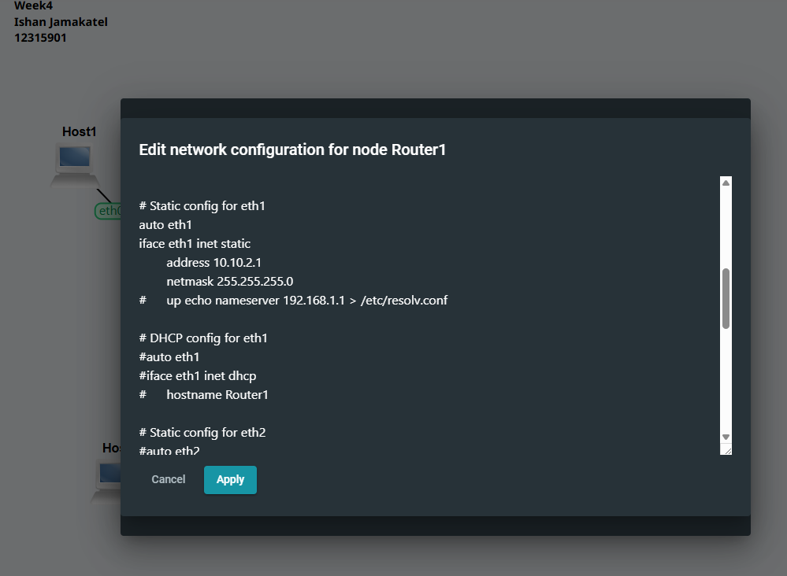
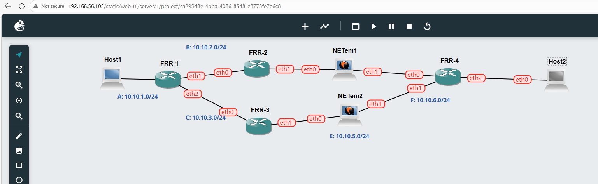
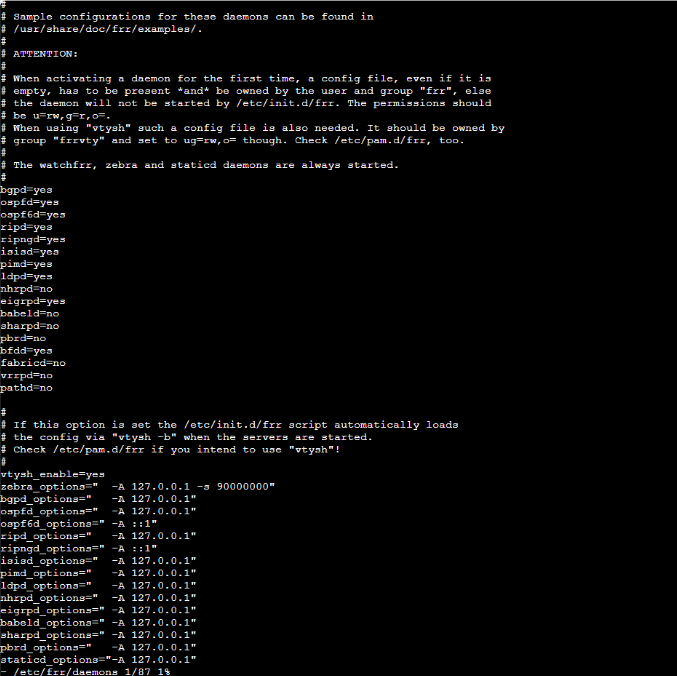
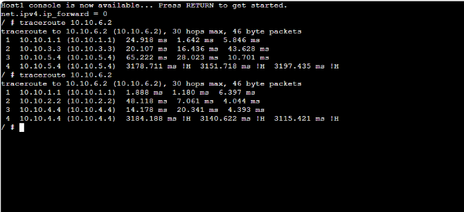

# Week 4 – Network Configuration and Routing

## Overview
This week includes configuring static IP addresses (Task 1) and setting up OSPF routing (Task 2) to allow communication between different networks.

---

# Task 1 – Static IP Configuration

## Topology

This shows the basic network setup with 3 hosts connected through a switch and a router.

---

## Host Configurations

Host1 is assigned a static IP address and default gateway so it can communicate outside its network.

Host2 is configured similarly with a different IP address in the same subnet.

Host3 is placed on a different network and uses the router as its gateway.

---

## Router Configuration

This interface connects to the first network (Host1 and Host2 side).

This interface connects to the second network (Host3 side), allowing communication between networks.

---

## Connectivity Test

Ping was used to test communication between hosts. The successful replies show that the network is working correctly.

---

## Result
All devices were able to communicate, confirming that the IP configuration and routing were correct.

---

# Task 2 – OSPF Routing

## Topology

This topology shows multiple routers connected across different networks using OSPF.

---

## FRR Configuration

FRR services were enabled to allow routing protocols like OSPF to run on the routers.

---

## Routing Table

This shows the routing table with networks learned through OSPF. It confirms that routers are sharing route information.

---

## OSPF Routes

This output shows routes learned specifically through OSPF, including next-hop information.

---

## Traceroute

Traceroute shows the path taken between networks, proving that routing is working across multiple routers.

---

## Result
OSPF successfully allowed communication between different networks by dynamically sharing routing information.
