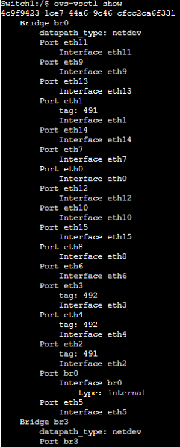
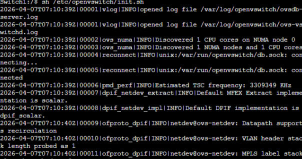
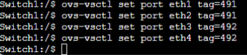
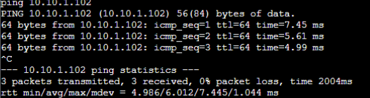
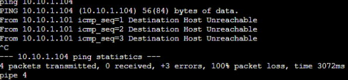
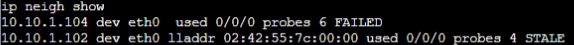
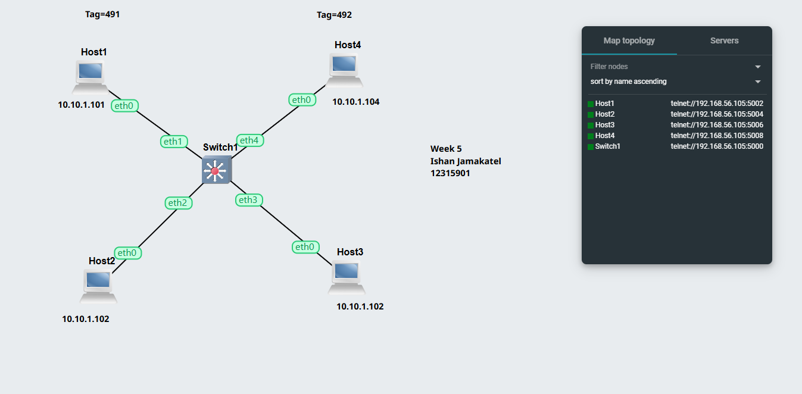
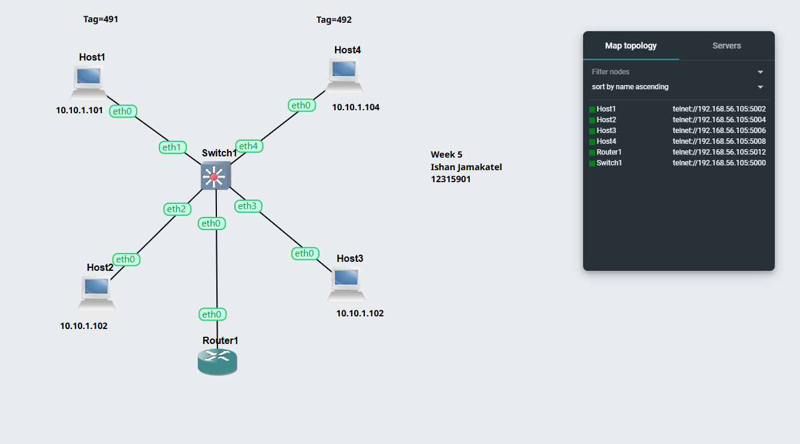
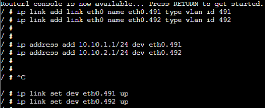
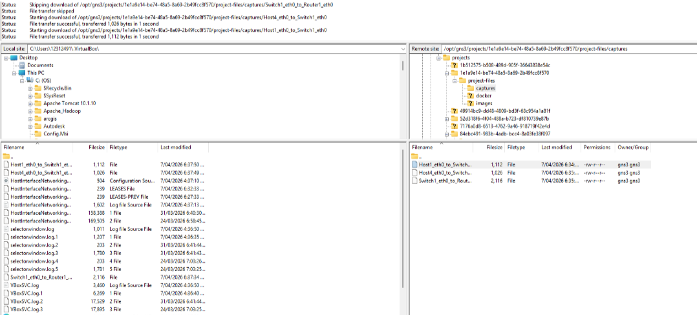

# Week 5 Assignment

This week’s lab is about VLAN configuration on a switch and VLAN routing using a router.

---

## Task 1 – Setup VLANs on Switch

In this task, I created a network with 4 Linux hosts and 1 OpenvSwitch.  
All hosts were first connected to the switch. Then I configured VLANs to separate the hosts into 2 groups.

### Network Topology

This screenshot shows the network for Task 1.  
Host1 and Host2 are in one VLAN.  
Host3 and Host4 are in another VLAN.

### VLAN Configuration Commands

In this step, I configured VLAN tags on the switch ports:
- `eth1` and `eth2` → VLAN 491
- `eth3` and `eth4` → VLAN 492

### Ping Test – Same VLAN

This ping was successful because both hosts are in the same VLAN.

### Ping Test – Different VLAN

This ping failed because the hosts are in different VLANs.  
This shows that the VLAN separation is working correctly.

### ARP Table Check

This screenshot shows the ARP table result.  
It helps to check whether the host can find the MAC address of another device.

### Switch Ports and Tags

This output shows the switch port details and VLAN tags.  
It confirms that the ports were assigned to the correct VLANs.

---

## Task 2 – Setup VLANs on a Router

In this task, I copied the previous setup and added a router.  
The router was used to allow communication between the two VLANs.

### Network Topology

This screenshot shows the updated network with the router connected to the switch.

### Router VLAN Configuration

In this step, I created VLAN sub-interfaces on the router:
- `eth0.491`
- `eth0.492`

Then I assigned IP addresses to them:
- `10.10.1.1/24`
- `10.10.2.1/24`

This allows the router to communicate with both VLANs.

### Ping Test Between VLANs

This ping was successful because the router forwards traffic between the two VLANs.

### Project Export / File Check

This screenshot shows the exported files or saved project files for the lab.

---

## Conclusion

In this lab, I learned how to:
- configure VLANs on an OpenvSwitch
- assign switch ports to different VLANs
- test communication inside and outside VLANs
- configure a router for inter-VLAN communication

Task 1 showed that devices in different VLANs cannot communicate directly.  
Task 2 showed that a router can be used to allow communication between VLANs.
