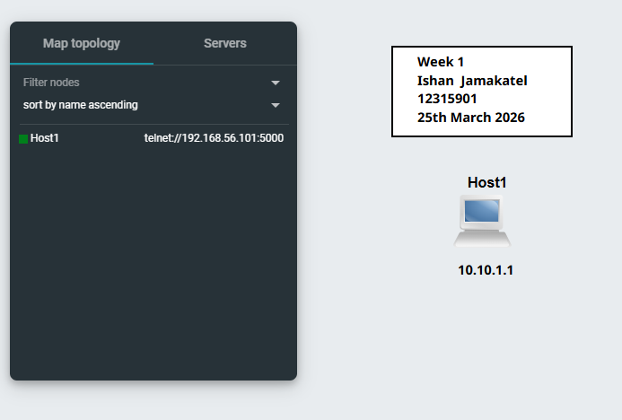
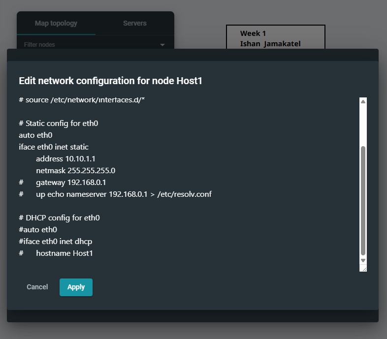
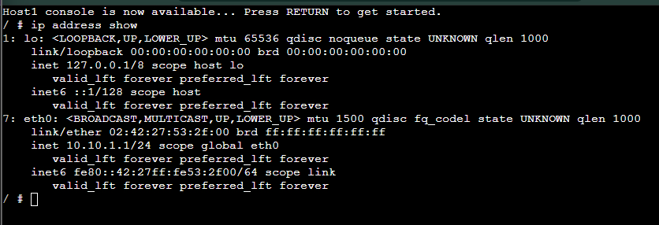

# Week 1 – GNS3 Basics

## Overview
This week involved setting up a GNS3 project and configuring a node with a static IP address.

## Screenshots
## Screenshots

### GNS3 Setup

### Network Configuration

### Verification

## Configuration
A node was configured in GNS3 by editing the network interface file.

- IP Address: 10.10.1.1  
- Netmask: 255.255.255.0  

## Testing Results
Command used:
ip address show

Result:
The output shows that the eth0 interface is assigned the IP address 10.10.1.1/24.

This confirms that the configuration was successful.

## Key Concepts
- GNS3 project setup  
- Static IP configuration  
- Network interface configuration  

## Reflection
This task helped me understand how network simulation works in GNS3. Configuring the IP address manually showed how devices are assigned addresses. Verifying the configuration using the command output helped confirm that the setup was correct.
